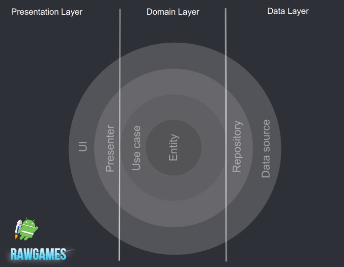

# RAWGames :rocket:

## Table of Contents
- [Demo](#demo)
- [Introduction](#introduction)
- [Modules](#modules)
- [Testing](#testing)
- [Libraries Used](#libraries_used)
- [License](#license)

## Demo

  
  

## Introduction
app that allows you to search and discover video games according to your preferences.
the project using: `clean architecture`,`MVVM` setup, `Coroutines`, `Kotlin Flows` and `LiveData`.

## Modules
* **app** - The application module with access to **all the application**
* **data** - Android module that **can only access domain module**
* **domain** - Kotlin module that **cannot access any other module**
* presentation layer - Android modules that **can only access domain module**
* **feature-games-list** - Android module that handle Games List Feature
* **feature-favorite-genere** - Android module that handle Genere List Feature and set Favorite or edit Genere
* **featur-search** - Android module that handle Searching in database
* **navigation** - Android jetpack navigation abstraction (it contains the navigation config file) **cannot access any other module**

And one extra module:
* **core** - Base classes module (factories, events, etc.) that **cannot access any other module**

## Testing

## Libraries Used
* [Coroutines][0] Library support for Kotlin coroutines.
* [Flows][1] for asynchronous data streams.
* [LiveData][2] for reactive style programming (from VM to UI).
* [Navigation][3] for in-app navigation.
* [Koin][4] for dependency injection.
* [Retrofit][5] for REST api communication.
* [Timber][6] for logging.
* [AndroidX Test Library][7] for providing JUnit4 and functions as `launchActivity` in UI tests
* [Glide][8] Image downloading and caching library
* [Paging3][9] Library that Load data in pages, and present it in a RecyclerView.
* [Room][10] Library that Create, store, and manage persistent data backed by a SQLite database.
* [DataStore][11] Library that Store data asynchronously, consistently, and transactionally, overcoming some of the drawbacks of SharedPreferences

[0]:  https://github.com/Kotlin/kotlinx.coroutines
[1]:  https://kotlin.github.io/kotlinx.coroutines/kotlinx-coroutines-core/kotlinx.coroutines.flow/-flow/
[2]:  https://developer.android.com/topic/libraries/architecture/livedata
[3]:  https://developer.android.com/topic/libraries/architecture/navigation/
[4]:  https://insert-koin.io/
[5]:  https://github.com/square/retrofit
[6]:  https://github.com/JakeWharton/timber
[7]:  https://github.com/android/android-test
[8]:  https://github.com/bumptech/glide
[9]:  https://developer.android.com/jetpack/androidx/releases/paging
[10]: https://developer.android.com/jetpack/androidx/releases/room
[11]: https://developer.android.com/jetpack/androidx/releases/datastore

## License
    Copyright 2021 Fernando Prieto Moyano

    Licensed under the Apache License, Version 2.0 (the "License");
    you may not use this file except in compliance with the License.
    You may obtain a copy of the License at

       http://www.apache.org/licenses/LICENSE-2.0

    Unless required by applicable law or agreed to in writing, software
    distributed under the License is distributed on an "AS IS" BASIS,
    WITHOUT WARRANTIES OR CONDITIONS OF ANY KIND, either express or implied.
    See the License for the specific language governing permissions and
    limitations under the License.
